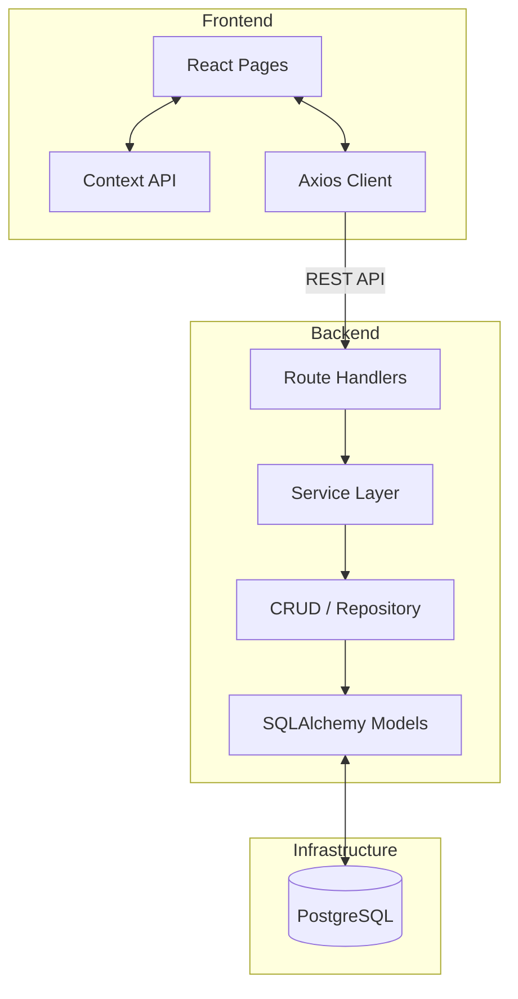
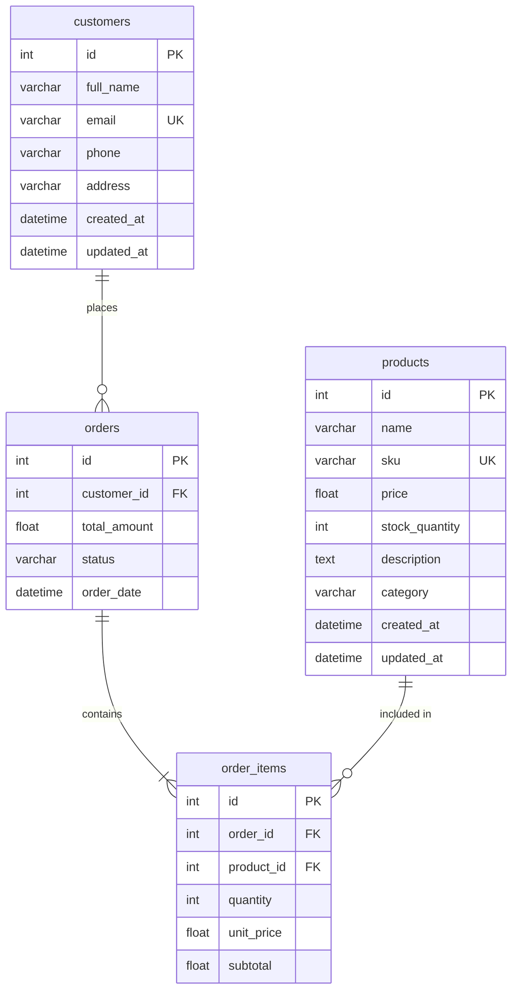

# Ethara AI — Inventory & Order Management System

A full-stack inventory and order management system built with FastAPI, React, and PostgreSQL. Fully containerized with Docker and deployed on cloud platforms.

## Live Deployment

| Service | URL |
|---------|-----|
| Frontend (Vercel) | [https://ethara-inventory-management-ochre.vercel.app](https://ethara-inventory-management-ochre.vercel.app) |
| Backend API Docs (Render) | [https://ethara-inventory-api-a3j5.onrender.com/docs](https://ethara-inventory-api-a3j5.onrender.com/docs) |
| Docker Hub Image | [https://hub.docker.com/r/nikeshya/ethara-backend](https://hub.docker.com/r/nikeshya/ethara-backend) |

> The backend is hosted on Render's free tier. The first request may take 30-50 seconds if the instance is idle.

## Tech Stack

**Backend:** Python 3.11, FastAPI, SQLAlchemy 2.0, Alembic, Pydantic V2, Pytest

**Frontend:** React 18 (Vite), React Router v6, Context API, Tailwind CSS v4, Axios, React Hook Form

**Infrastructure:** Docker, Docker Compose, Nginx, GitHub Actions (CI/CD), Vercel, Render

## Features

**Product Management** — CRUD operations with unique SKU validation and stock tracking

**Customer Management** — CRUD operations with unique email enforcement

**Order Management** — Multi-product orders with automatic stock reduction and total calculation

**Dashboard** — Aggregate stats including total products, customers, orders, revenue, and low stock alerts

**Business Rules:**
- Product SKU and customer email are unique at the database level
- Orders cannot be placed when stock is insufficient (returns 400)
- Stock is reduced atomically within the same database transaction as order creation
- Total amount is calculated server-side

## Architecture



## Database Schema



## Project Structure

```
backend/
  app/
    api/            # Route handlers
    core/           # Config, logging
    crud/           # Database queries
    database/       # Session setup
    exceptions/     # Error handlers
    middlewares/     # Request logging
    models/         # ORM models
    schemas/        # Pydantic schemas
    services/       # Business logic
    main.py         # Entry point
  alembic/          # Migrations
  tests/            # Test suite
  Dockerfile
  seed.py           # Demo data

frontend/
  src/
    components/     # Reusable UI components
    context/        # Global state
    pages/          # Page components
    services/       # API client
  Dockerfile
  vercel.json

docker-compose.yml
.github/workflows/  # CI/CD pipeline
```

## Getting Started

### Docker Compose (recommended)

```bash
git clone https://github.com/nikeshya/Ethara-Inventory-Management.git
cd Ethara-Inventory-Management
cp .env.example .env
docker-compose up --build
```

Frontend runs on `http://localhost:3000`, backend on `http://localhost:8000/docs`.

The database is automatically migrated and seeded with demo data.

### Manual Setup

**Backend:**
```bash
cd backend
python -m venv venv
source venv/bin/activate
pip install -r requirements.txt
alembic upgrade head
python seed.py
uvicorn app.main:app --reload
```

**Frontend:**
```bash
cd frontend
npm install
npm run dev
```

## API Endpoints

| Method | Endpoint | Description |
|--------|----------|-------------|
| GET | `/` | API info |
| GET | `/health` | Health check |
| GET | `/api/v1/dashboard/stats` | Dashboard statistics |
| GET, POST | `/api/v1/products` | List / Create products |
| GET, PUT, DELETE | `/api/v1/products/{id}` | Get / Update / Delete product |
| GET, POST | `/api/v1/customers` | List / Create customers |
| GET, DELETE | `/api/v1/customers/{id}` | Get / Delete customer |
| GET, POST | `/api/v1/orders` | List / Create orders |
| GET, DELETE | `/api/v1/orders/{id}` | Get / Delete order |

## Docker

```bash
docker-compose up -d          # Start all services
docker-compose down            # Stop all services
docker-compose up -d --build   # Rebuild and start
docker-compose logs -f         # View logs
docker-compose exec backend pytest tests/  # Run tests
```

## Design Decisions

- **Repository pattern** separates database logic from route handlers, making the code testable and maintainable.
- **Service layer** centralizes business rules (stock validation, price calculation) so they aren't scattered across route handlers.
- **Atomic transactions** ensure order creation and stock reduction either both succeed or both fail.
- **Centralized exception handling** maps domain errors to appropriate HTTP status codes without cluttering route logic.

## Author

Nikesh Kumar Yadav
